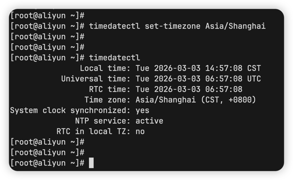

如果你设置了自动重启的时间为早上6点，但是没有重启，在下午2点却重启了

那就说明你部署饥荒管理平台的机器存在时区问题

::: tip
北京时间在东八区，UTC+8，即06:00:00 + 08:00:00 = 14:00:00
:::

你可以设置时区为北京，以下操作均以`Ubuntu`为例：

1. 设置时区
```shell
timedatectl set-timezone Asia/Shanghai
```

2. 验证设置
```shell
timedatectl
```



::: warning
饥荒管理平台的所有定时任务都采用本地时区，因此，请确保本地时区正确设置，否则就会出现定时任务在错误的时间执行
:::
