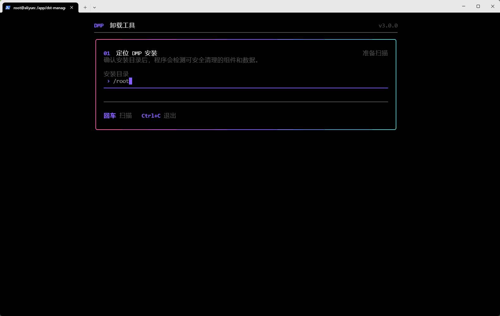
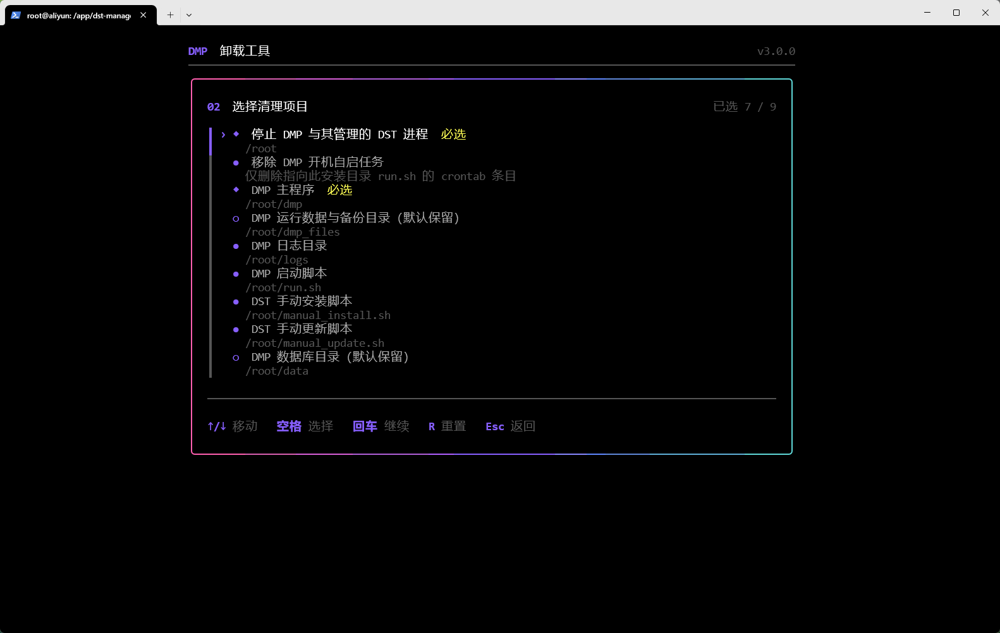
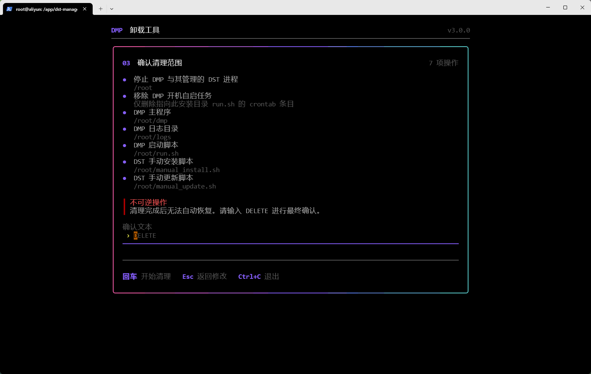
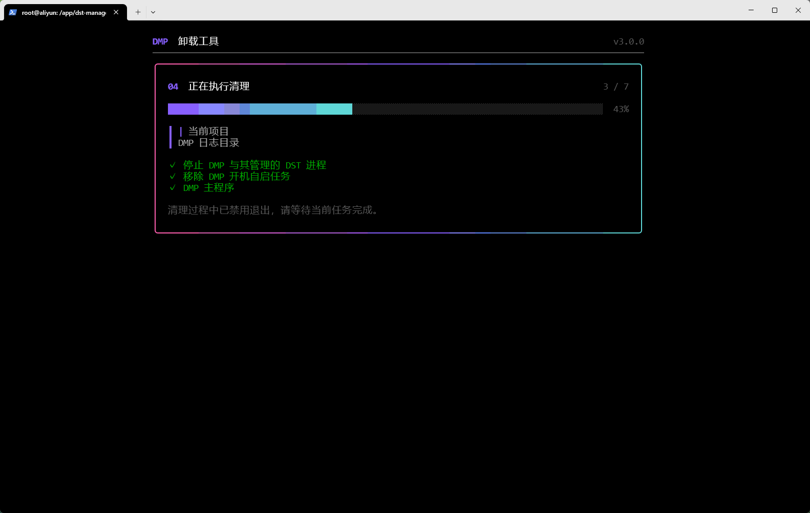
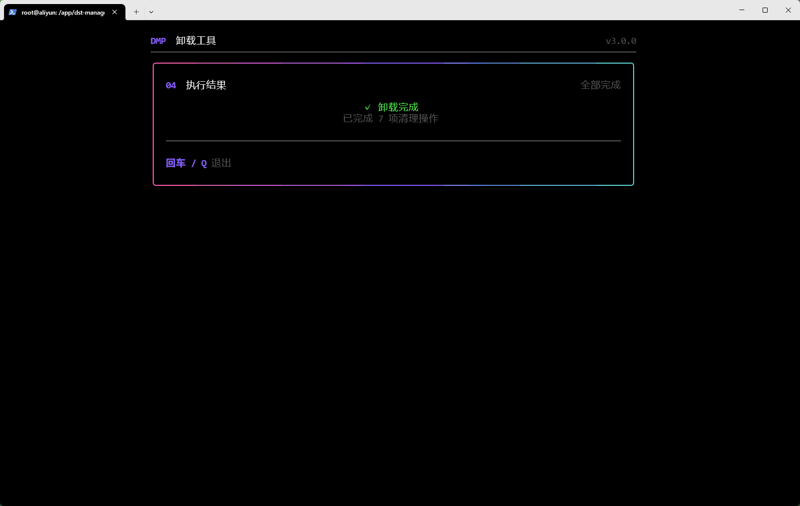

:::info
用于在 Linux amd64 服务器上交互式卸载 DMP 饥荒管理平台
:::

## 下载卸载程序

前往`dst-management-platform-uninstall`项目的[Release](https://github.com/miracleEverywhere/dst-management-platform-uninstall/releases)页面下载对应版本，例如：

```text
dmp-uninstall-v3.0.0-amd64
```

添加执行权限并启动：

```shell
chmod +x dmp-uninstall-v3.0.0-amd64
./dmp-uninstall-v3.0.0-amd64
```

文件名中的版本号请替换为实际下载的版本。

## 开始卸载

#### 选择安装目录

程序启动后会要求确认 DMP 安装目录。默认优先使用可识别的当前目录，否则使用当前用户的 Home 目录。

也可以在启动时直接指定安装目录：

```shell
./dmp-uninstall-v3.0.0-amd64 --root /path/to/dmp
```

确认路径后按 `回车` 开始扫描。



#### 选择清理项目

扫描完成后，选择需要清理的内容：

| 按键 | 操作 |
| --- | --- |
| `↑` / `↓` 或 `K` / `J` | 移动光标 |
| `空格` | 选择或取消当前项目 |
| `回车` | 进入最终确认 |
| `R` | 恢复默认选择 |
| `Esc` | 返回安装目录 |

标记为“必选”的项目无法取消；标记为“默认保留”的数据只有手动选中后才会清理。



#### 确认清理范围

检查最终清单。确认无误后输入大写的 `DELETE`，再按 `回车` 开始卸载。按 `Esc` 可以返回修改选择。



#### 等待卸载完成

卸载期间会显示当前项目、已完成项目和总体进度。为避免任务被中断，清理过程中不能退出程序。



#### 退出程序

卸载完成后，按 `回车` 或 `Q` 退出。



:::tip
有缘再见
:::
