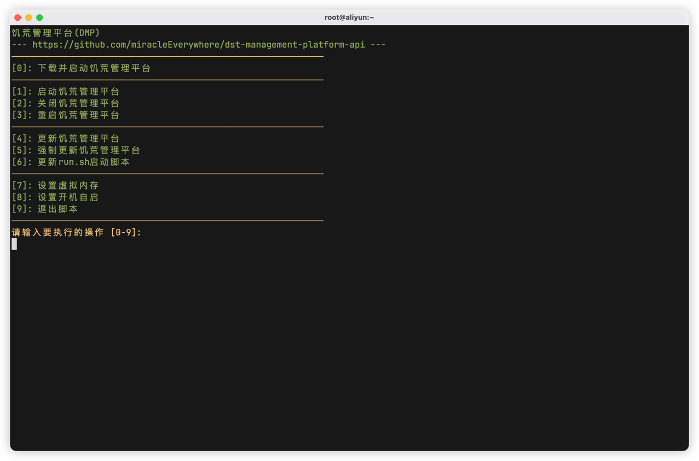
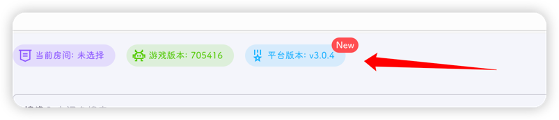

饥荒管理平台也是有版本的，目前大版本已经到`v3`

作者建议更新到最新版本，每次平台版本迭代，都会修复一些bug，并对各种功能进行优化

## 更新饥荒管理平台

::: danger
请确认当前用户是否为root，可输入命令`whoami`进行查看
:::

进入到服务器终端，即快速上手的[服务器登录](../../quick-start/server.md#服务器登录)

运行启动脚本 `./run.sh`

输入 `4` 即可实现自动更新

## 更新run.sh脚本

::: danger
请确认当前用户是否为root，可输入命令`whoami`进行查看
:::

当然，`run.sh`启动脚本也是会有更新的，当然更新频率很低

同上，需要运行`run.sh`脚本，选择`6`即可

## 如何得知平台有更新

1. 可以[加群](../group.md)，获取第一手更新信息

2. 版本号出现红点提示

