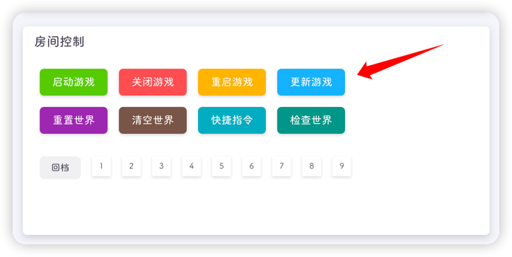
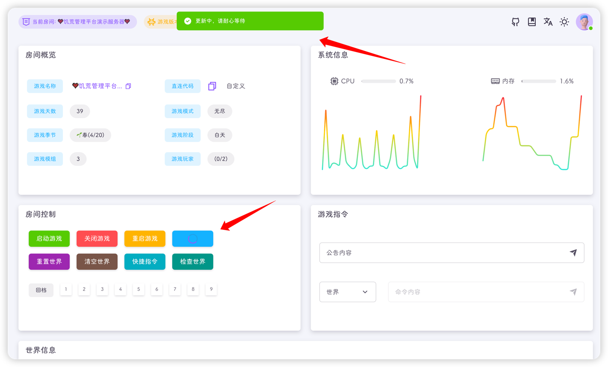
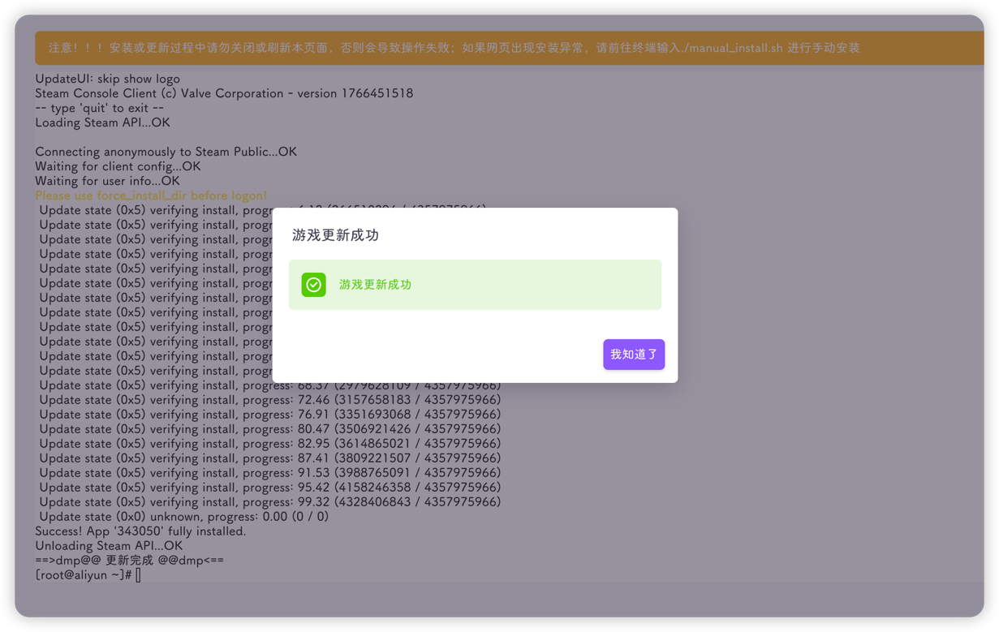

::: info
游戏也是需要更新的，不更新游戏是搜不到房间的
:::

当你发现游戏版本变黄了后，那就说明饥荒需要更新了

你可以点击控制面板的更新游戏按钮

更新方式有两种，分别是前台更新与后台更新

- 前台更新：会跳转至游戏安装页面，点击更新游戏即可，等待更新，更新完成后会有响应的提示`>=v3.0.5`

- 后台更新：指平台进行静默更新，更新时按钮会进入Loading状态，更新完成后恢复，手动刷新页面即可

