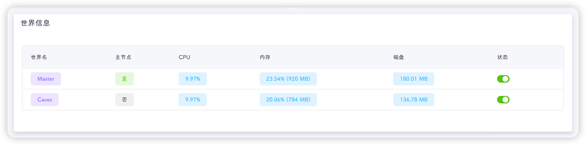
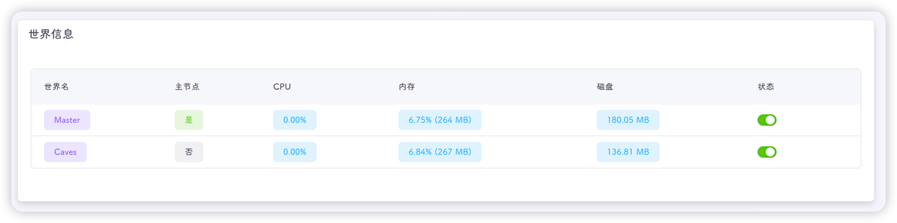
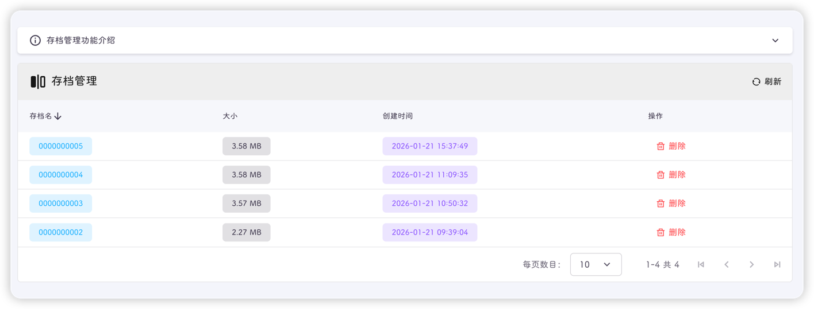

::: info
房间异常是指你使用饥荒管理平台创建好房间并启动游戏后，无法搜索到该房间或无法通过直连代码进入游戏
:::

::: tip
造成房间异常的因素有很多，多到数不过来，倒也**不必焦急**，因为99%的问题都是可以解决的，剩下的1%重开也能解决
:::

::: important
我强烈建议你能看完本节内容，就算没有遇到，也能给你提供一个解决思路
:::

::: warning
以下内容均以饥荒管理平台正常运行为前提
:::

## 排查思路

````mermaid
flowchart TD
    Start[🔴 无法进入房间] --> Step1[📊 查看世界运行状态]
    Step1 --> Step2[📋 查看游戏日志]
    Step2 --> Step3[🔍 查找日志报错关键字]
    Step3 --> Step4[🤔 根据关键字推断问题所在]
    Step4 --> Step5[⚡ 执行对应的操作]
    Step5 -->|✅ 可以进入房间| End[🥳 问题解决]
    Step5 --> Start
````

接下来说一个游戏是否真正启动的判断标准，前往控制面板，最下方的世界信息的状态**均为**绿色开启状态，则我们认为游戏是**启动**的，如果有任意一个，尤其是主节点为关闭状态，则认为游戏是**未启动**的



## 游戏未启动

游戏未启动的原因通常有以下几点，我们分类排查

#### 模组冲突

::: info
平台中显示一个或多个世界未启动，无法搜索到房间，直连代码无法进入游戏
:::

在控制面板点击启动游戏后，世界变为启动，过一会后变为未启动

进入游戏日志，发现有关`lua`的报错

```text
[00:00:12]: error calling LoadPrefabFile in mod workshop-818739975 (Adshovel): 
[string "scripts/mainfunctions.lua"]:160: Error loading file prefabs/dug_cave_banana_tree

	no file '../mods/workshop-1207269058/scripts/prefabs/dug_cave_banana_tree.lua' (checked with custom loader)
	no file '../mods/workshop-1595631294/scripts/prefabs/dug_cave_banana_tree.lua' (checked with custom loader)
	no file '../mods/workshop-2189004162/scripts/prefabs/dug_cave_banana_tree.lua' (checked with custom loader)
	no file '../mods/workshop-1418746242/scripts/prefabs/dug_cave_banana_tree.lua' (checked with custom loader)
	no file '../mods/workshop-3138571948/scripts/prefabs/dug_cave_banana_tree.lua' (checked with custom loader)
```

::: tip
日志关键字：**error xxx in mod workshop-模组ID**

如上面日志中报错的模组为Adshovel，ID为818739975
:::

在模组设置页面中，禁用报错的模组，重启游戏即可

## 游戏已启动

游戏已启动，但进入游戏异常的原因通常有以下几点，我们分类排查

这类情况通常表现为：世界内存占用很低，如下图仅占用200多MB，正常占用应该大于400MB



#### 令牌异常

::: info
平台中显示所有世界为启动，但无法搜索到房间，直连代码无法进入游戏
:::

接下来我们查看游戏日志，如果发现有以下内容，那就可以判断为令牌异常

```text
[00:00:08]: [200] Account Failed (6): "E_INVALID_TOKEN"
[00:00:08]: !!!!!!!!!!!!!!!!!!!!!!!!!!!!!!!!!!!!
[00:00:08]: !!!! Your Server Will Not Start !!!!
[00:00:08]: !!!!!!!!!!!!!!!!!!!!!!!!!!!!!!!!!!!!
[00:00:08]: No auth token could be found.
[00:00:08]: Please visit https://accounts.klei.com/account/game/servers?game=DontStarveTogether
[00:00:08]: to generate server configuration files
```

::: tip
日志关键字：**E_INVALID_TOKEN**
:::

进入房间设置页面更换正确的游戏令牌并重启游戏即可

#### 端口冲突

::: info
平台中显示所有世界为启动，但无法搜索到房间，直连代码无法进入游戏
:::

查看游戏日志，发现类似于以下内容

```text
[00:00:19]: [Error] Server failed to start!
[00:00:19]: Unhandled exception during server startup: RakNet UDP startup failed: SOCKET_PORT_ALREADY_IN_USE (5)
[00:00:19]: PushNetworkDisconnectEvent With Reason: "ID_DST_INITIALIZATION_FAILED", reset: false
[00:00:19]: Details: SOCKET_PORT_ALREADY_IN_USE
[00:00:19]: [Shard] Stopping shard mode
```

::: tip
日志关键字：**SOCKET_PORT_ALREADY_IN_USE**
:::

进入房间设置页面，查看是否有相同的端口，或者多个房间有相同的端口，修改冲突的端口并重启游戏即可

如果没有发现冲突的端口，可以等10分钟再启动游戏，因为端口存在缓存：[查看详情](https://forums.kleientertainment.com/forums/topic/68550-socket-port-already-in-use/)

#### 存档损坏

::: info
平台中显示所有世界为启动，但无法搜索到房间，直连代码无法进入游戏
:::

查看游戏日志，发现类似于以下内容

```text
[00:00:17]: Loading world: session/5790E4D8FD3C09E8/0000000005	
[00:00:17]: [string "local savedata = {}..."]:14: attempt to call global 'x' (a nil value)
LUA ERROR stack traceback:
        local savedata = {}
local tablefunctions = {}
tablefunctions["shard_network_fn"] = function()
return {persistdata={shard_daywalkerspawner={location="cavejail"}}}
end
savedata["shard_network"] = tablefunctions["shard_network_fn"]()
tablefunctions["mods_fn"] = function()
return {["workshop-2937640068"]={active=true}}
```

::: tip
日志关键字：
- **LUA ERROR stack traceback**
- **attempt to call global 'xxx' (a nil value)**
- **session/xxxxx/xxxxxx**
:::

可进入平台工具-游戏存档页面，删除日志中提到的游戏存档，即强制回档

上述日志中的游戏存档文件为`0000000005`



删除完成后重启游戏即可
