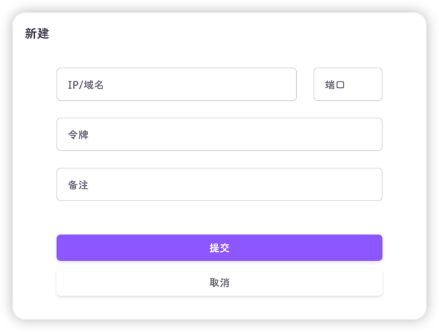
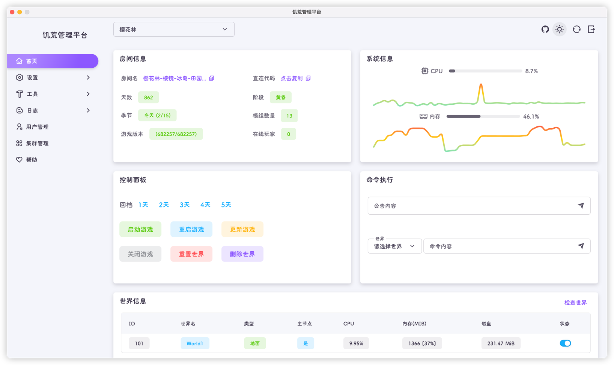

饥荒管理平台App是一个桌面级应用，支持Windows(amd64)，Linux(amd64)和MacOS(arm64)

使用App可以同时管理多个饥荒管理平台(DMP)

## 安装方法

首先进入App项目[https://github.com/miracleEverywhere/dst-management-platform-desktop](https://github.com/miracleEverywhere/dst-management-platform-desktop)， 选择右边的 [releases](https://github.com/miracleEverywhere/dst-management-platform-desktop/releases)， 下载对应版本的安装包安装即可

::: tip
Github-release安装包的命名规则为：`DMP-{版本号}-{平台}-{架构}.{对应文件扩展名}`
:::

| 系统      | 文件名                       | 架构    |
|---------|---------------------------|-------|
| Windows | DMP-{版本号}-win32-amd64.exe | amd64 |
| MacOS | DMP-{版本号}-darwin-arm64.dmg | arm64 |
| Linux | DMP-{版本号}-linux-amd64.AppImage | amd64 |

MacOS用户可能会遇到 xxx 已损坏的问题，请打开终端，输入下面两条命令即可：
```zsh
sudo spctl --master-disable # 需要输入开机密码
```
```zsh
sudo xattr -rd com.apple.quarantine /Applications/饥荒管理平台.app
```

::: warning
饥荒管理平台App不支持32位系统
:::

## 使用方法

#### 录入DMP
1. 打开你要录入的DMP网页，进入 工具-创建令牌 页面

2. 选择合适的令牌过期时间，创建一个令牌

3. 打开饥荒管理平台App，点击 **+** 录入

4. 输入对应的IP、端口、令牌、备注(非必须)，点击提交即可



#### 进入管理页面

录入完成后，可以看到对应的平台的CPU、内存、集群、世界情况

点击右上角按钮可以进行编辑

点击 **进入** 按钮即可

#### 使用

具体使用方法与网页版的DMP无异


