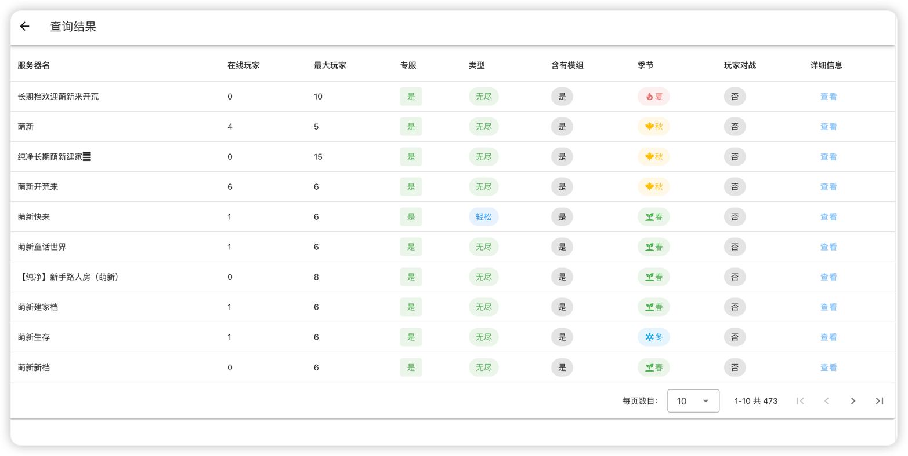

::: tip
项目地址：[https://github.com/miracleEverywhere/dst-search](https://github.com/miracleEverywhere/dst-search)
:::

## 项目介绍

可以在网页上查询饥荒服务器，通过房间名进行搜索

其实网上有很多这样的页面，但我觉得不好看，就花了点时间，写了一个自认为满意的

当夜还有很多QQ机器人，封剩下的都不好用

## 项目预览

首页可以选择要查询的范围，默认是**东亚**和**东南亚**

在下方的输入框中输入饥荒房间名，支持模糊搜索

查询结果

详细信息

## 项目部署

- 打开[https://github.com/miracleEverywhere/dst-search/releases](https://github.com/miracleEverywhere/dst-search/releases)页面，下载最新版本的二进制文件

- 将下载好的二进制文件上传至服务器

- 输入`chmod +x dst-search`命令添加执行权限

- 输入`nohup ./dst-search -l 80 &`命令后台启动
  - `-l`参数是启动端口，可以任意修改，默认为`7777`

通过以上4步，就完成部署了

## 问题反馈

如果遇到了什么问题或者有什么建议，[前往提交issue](https://github.com/miracleEverywhere/dst-search/issues)

