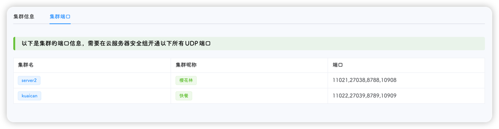

当我们启动饥荒服务器后，可以从游戏大厅搜索房间并进入，但是通过直连代码无法进入游戏，就算能进入游戏，也会卡卡的，这是因为我们没有开通防火墙策略导致的

首先打开 **集群管理** 页面，并切换到**集群端口**标签页

这个页面会展示你需要开通的所有饥荒端口，如上图中的: 
**11021,27038,8788,10908,11022,27039,8789,10909**

我们回到腾讯云控制台页面，点击**防火墙**

点击左侧的**添加规则按钮**，在弹出对话框中填入对应的端口

::: tip
来源可以选择全部IPv4地址，也可以输入0.0.0.0/0
协议选择UDP
端口就是平台中，集群端口页面的所有端口，可以单个输入，也可以输入范围(例如 8000-14000) !!，也可以开放多有UDP端口(1-65535)(不推荐但有用)!!
:::

添加完成后，就可以通过直连代码进入游戏了，对应的延迟也会变低(大多数情况)

::: tip
影响饥荒延迟的因素有很多，例如你与服务器之间的物理距离，当前你的网络状况等等等等，耐心一个一个慢慢排查
:::
