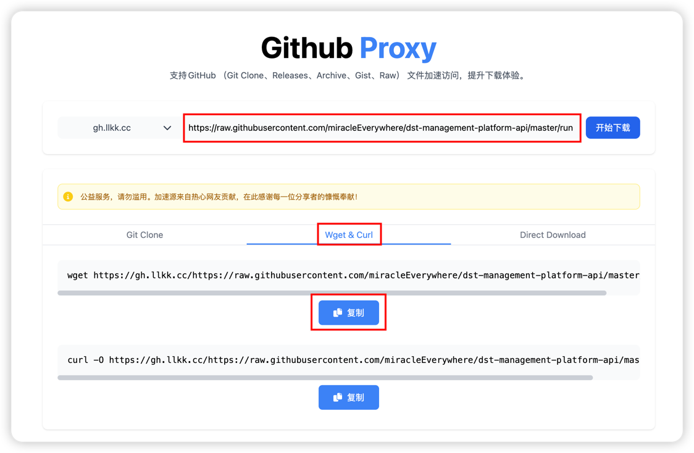

::: important
**自动安装**和**手动安装**选择其中一种就行，可以先使用自动安装，如果出现任何下载失败的情况，再使用手动安装
:::

## 自动安装
### 下载启动脚本
打开上一节的终端页面，输入下方代码下载run.sh启动脚本

```shell
# 执行以下命令，下载脚本（使用加速节点）
cd ~ && wget https://github.acmsz.top/https://github.com/miracleEverywhere/dst-management-platform-api/raw/refs/heads/master/run.sh && chmod +x run.sh && ./run.sh
```

### 运行脚本
执行成功后输入0，即可完成安装


::: tip
如果出现上图中的启动成功字样，就代表已经安装成功了，可以进入下一节；
如果出现网络错误，请根据下方手动安装教程进行安装
:::

## 手动安装

::: info
因为饥荒管理平台源码及安装包都在Github上，如未进行Github加速可能会导致安装失败。因此，下面的教程不使用`run.sh`脚本的自动化能力，保证顺利安装。
:::

### 下载run.sh脚本
<code>run.sh</code> 脚本保存在Github上，直接下载有概率会失败，因此需要加速
##### 获取加速链接
1. 首先打开 [github.akams.cn](https://github.akams.cn) 加速站点，<strong>感谢社区无私奉献</strong>

2. 需要等待网页完全加载完毕，即网页标签页不再显示旋转的加载图标，以及下图中的红框出现网站


3. `https://github.com/miracleEverywhere/dst-management-platform-api/raw/refs/heads/master/run.sh` 将这个网址复制到加速站点的输入框中

4. 选择 Wget & Curl 后，点击第一个复制



##### 开始下载
1. 将复制的命令输入上一节打开的终端中，并按回车键执行

2. 并为下载好的`run.sh`添加执行权限：`chmod +x run.sh`


##### 开启SWAP
::: tip
饥荒专用服务器比较吃内存，所以需要开启SWAP(虚拟内存)，以避免服务器卡死。
:::

1. 输入 `./run.sh` 运行脚本

2. 输入 `7` 即可


### 部署饥荒管理平台
##### 获取最新版本
1. 在浏览器中打开这个页面：[获取饥荒管理平台最新版本](https://api.github.com/repos/miracleEverywhere/dst-management-platform-api/releases/latest)

2. 打开后输入 ctrl+f(MacOS为 command+f) 打开页面搜索，输入`browser_download_url`


##### 获取加速链接
1. 会出先两个结果，我们找到以 `dmp.tgz` 结尾的那个链接，复制下来

2. 回到加速站点，将复制的链接粘贴进输入框，并点击第一个复制


##### 下载并启动
1. 将复制好的命令粘贴到终端，按回车键运行


2. 输入命令解压下载好的压缩包：`tar zxvf dmp.tgz`，解压完成后输入：`./run.sh` 并输入：`1` 启动饥荒管理平台


到目前为止，饥荒管理平台就算部署成功，下一节我们将进行令牌申请