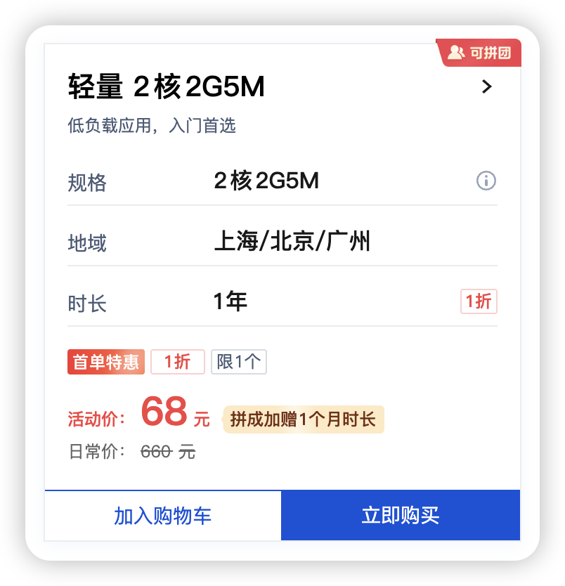
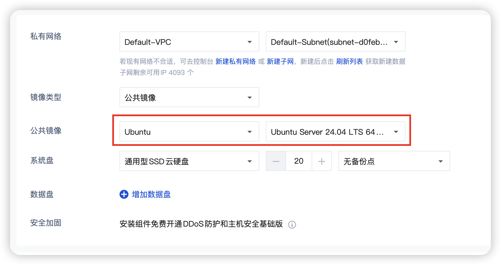
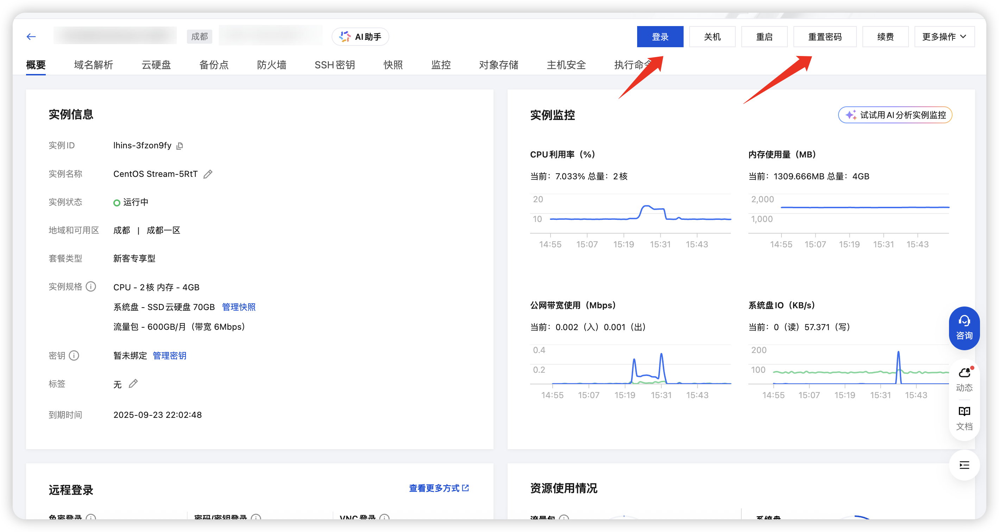
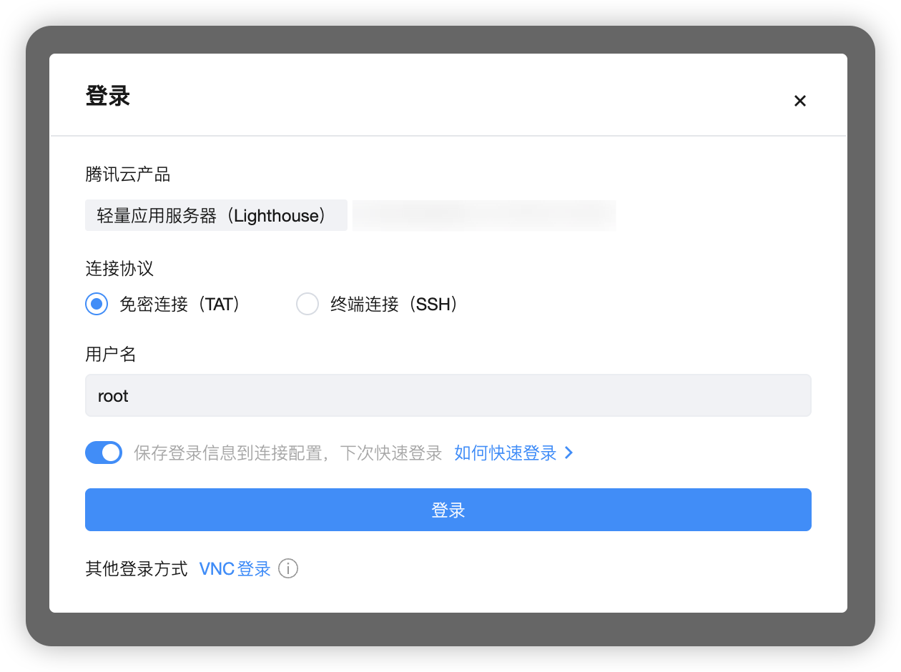
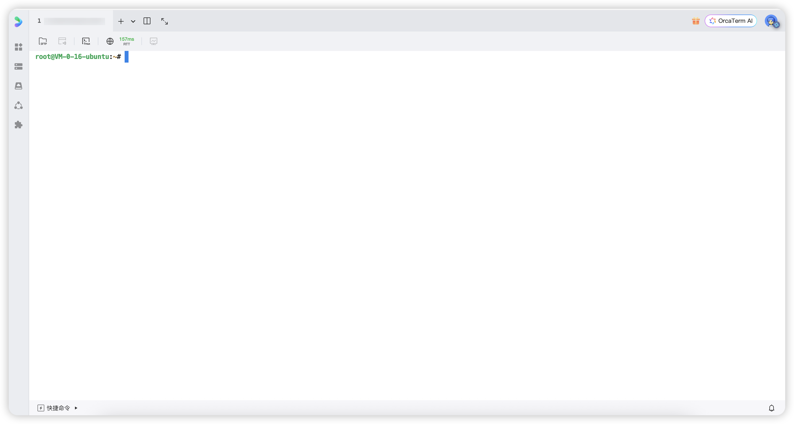

::: tip
本节不含任何广告，请放心食用
:::

## 厂商选择
无论便宜还是高性能，都<strong>不推荐</strong>小厂的云服务器，除非你有靠谱的渠道。  

国内的大厂就那么几个，腾讯云、阿里云、华为云等，选择哪个都可以。  

下面我将以腾讯云为例进行讲解。

## 服务器购买

#### 配置选择
1. 如果你想玩半纯净档，只有showme、5格装备栏等模组，其实2C2G3M(2个核心，2G内存，5Mbps带宽)的机器完全够用，当然要开启SWAP(即虚拟内存，后续会讲到如何开启)。

2. 如果你想多加几个大型模组，例如棱镜、勋章等，这些模组对服务器的性能就有所要求，一般推荐2C4G5M及以上的云服务器，并同时开启SWAP。

#### 镜像选择
注意购买过程中，服务器的镜像(系统)要选择 <code>Ubuntu 24.04 LTS</code> 及以上版本

完成购买后，点击右上角的<strong>控制台</strong>，找到自己已购买的云服务器(轻量应用服务器)，点击登录，如果忘记了密码可以点击重置密码

## 服务器登录
也可以直接免密登录，注意选择root用户(重要，后续的操作都需要使用root用户)

完成登录后，你将会看到如下界面，也意味着你完成了本节教程，可以进入下一节了

