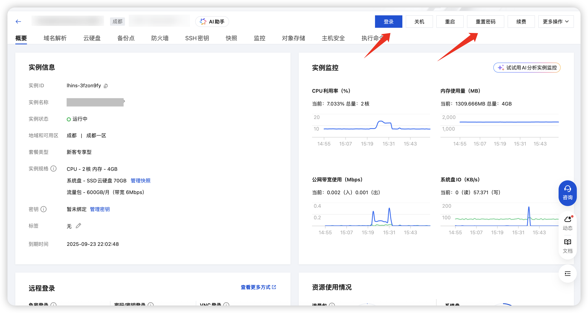

## 服务器选择

1. 如果你想玩半纯净档，只有showme、5格装备栏等模组，其实2C2G5M(2个核心，2G内存，5Mbps带宽)的机器完全够用，当然要开启[虚拟内存(SWAP)](../faq/dmp/swap.md)。

::: tip
2C2G的机器未开启虚拟内存 ，可能会在部署阶段就出现卡死
:::

2. 如果你想多加几个大型模组，例如棱镜、勋章等，这些模组对服务器的性能就有所要求，一般推荐2C4G5M及以上的云服务器，并同时开启SWAP。

::: info
大型模组会有更多的CPU与内存消耗，且注意：
饥荒是单核游戏，一个世界使用一个CPU核心；例如地面和洞穴，就只使用2个核心，你的CPU核心再多也用不到
想要流畅的游戏体验，则需要高主频的CPU
:::

3. 作者推荐[汉堡云服务器](https://hbyidc.com/recommend/OKkxTzgMP6k7)，专为饥荒打造！官方合作商「汉堡云」带来高性能游戏服务器，首月低至6折！

   - 云产品：NAT云（游戏云电脑）/ 云服务器ECS等多款上云产品
   - 地域选择： 湖北襄阳 / 内蒙古呼和浩特 / 江苏宿迁 / 中国香港 / 美国洛杉矶
   - CPU选择：从E5入门CPU到英特尔铂金CPU再到i9-12900K消费级CPU，均有涉猎
   - 新用户尊享DMP渠道价，云服务器ECS/轻量云LS/游戏云GYC产品首月6折

**优惠码**：`DMPqd6666` [点我立即购买](https://hbyidc.com/recommend/OKkxTzgMP6k7)

::: tip
汉堡云含有饥荒管理平台的系统镜像，小白购买云服务器后可直接开服，省去部署平台和安装游戏的步骤
详细步骤 [汉堡云操作指南](https://docs.miraclesses.top/quick-start/install.html)
:::

## 服务器购买

#### 镜像选择
注意购买过程中，服务器的镜像(系统)要选择 <code>Ubuntu 24.04 LTS</code> 及以上版本

完成购买后，点击右上角的<strong>控制台</strong>，找到自己已购买的云服务器(轻量应用服务器)，点击登录，如果忘记了密码可以点击重置密码

## 服务器登录
也可以直接免密登录，注意选择root用户(重要，后续的操作都需要使用root用户)

完成登录后，你将会看到如下界面，也意味着你完成了本节教程，可以进入下一节了

