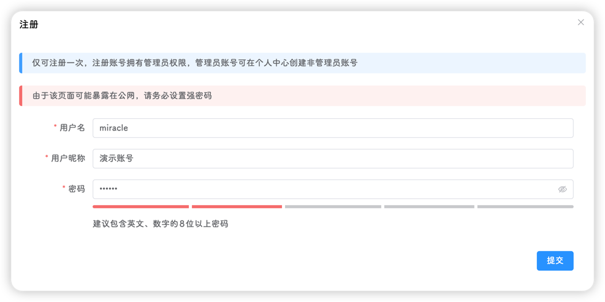
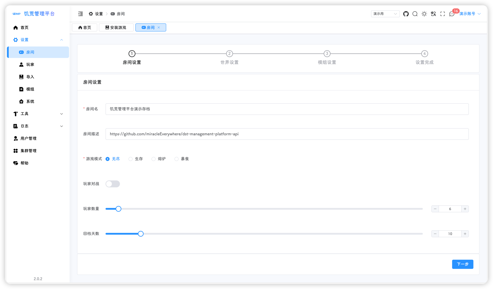
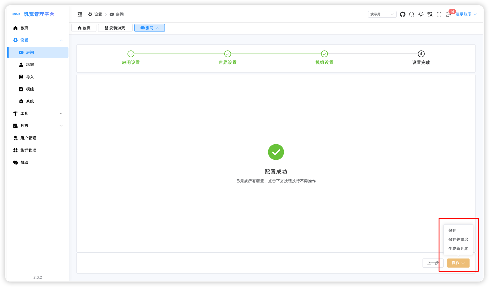
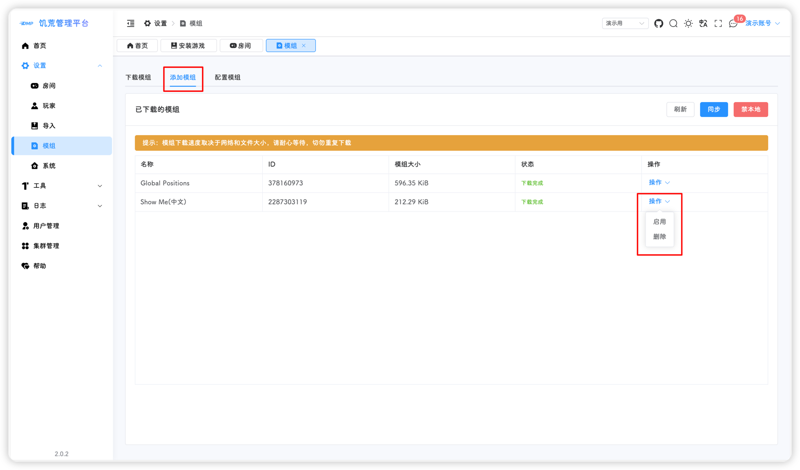
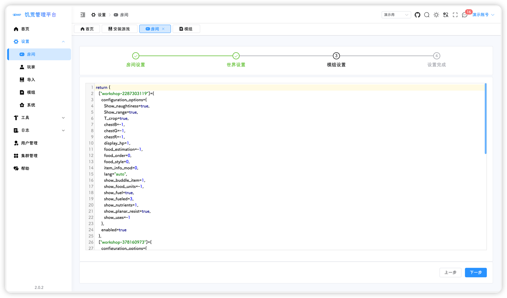
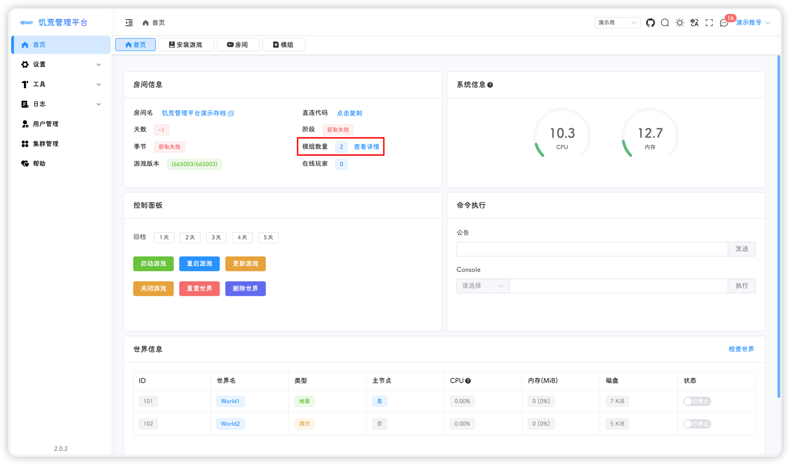
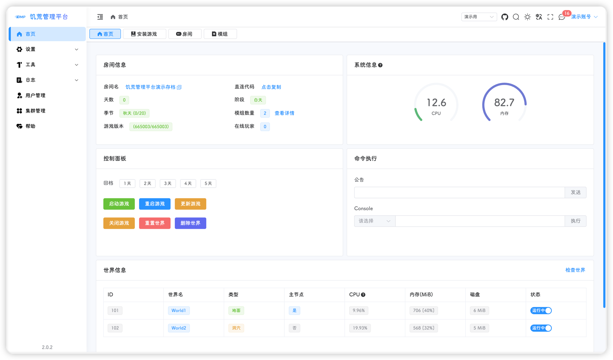

## 登录饥荒管理平台
#### 获取公网ip
1. 首先，我们回到腾讯云的控制面板，点击下方图片中的IPv4右边的复制按钮

2. 将复制好的IP粘贴进浏览器的地址栏并进入
::: tip
如果能顺利打开，则跳过2.1和2.2步骤，如果不能顺利打开，则需要去腾讯云的控制面板，开放80端口
:::

2.1 点击下图中的防火墙标签页，并点击添加规则按钮

2.2 按照下图配置规则并点击确定

#### 用户注册
1. 如果你顺利打开了饥荒管理平台的页面，恭喜你，已经成功了一半，接下来我们将进行用户的注册

2. 填写好用户名，用户昵称还有密码，点击提交即可完成注册
::: tip
一个平台只能注册一次，请快速完成注册操作，防止坏人捣乱
:::

3. 使用注册好的用户名密码进行登录

## 安装游戏
初次登录会提示游戏未安装，根据提示进行安装游戏或点击左侧 `安装游戏` 菜单，左边会显示系统的基本信息，点击右侧的 安装 按钮进行游戏安装

::: tip
饥荒游戏大概有4个多GB，安装时间取决于你的云服务器的下载速度和当时的网络环境，要耐心等待，并且不要重复安装和刷新页面（玩会儿手机吧👉🤳😎
:::

::: tip
如果出现了安装完成，进入 `房间总览` 还是显示游戏未安装，刷新网页就行😁
:::

::: tip
如果出现了安装失败或者一瞬间进度条就到100%，那么说明游戏安装有异常，大概率是网络环境不好，众所周知，steam能不能打开全看天意。我们需要再次点击安装，耐心等待👉🤳😎
:::

## 创建房间
就如游戏里一样，在开始之前需要创建一个房间来让大家一起玩，跟着下面的流程简单几步就可以完成设置

1. 游戏安装完成之后点击左侧 `房间总览`，会提示没有发现房间，点击左上角的新建按钮创建，根据提示点击按钮进入创建房间页面

2. 输入房间名、房间描述、选择游戏模式、玩家数量、回档天数，输入 [令牌申请](./token.md) 中申请的令牌，或者使用默认令牌（😁默认令牌是 `Miracle` 的，进游戏你不是管理员哦），点击右下角的 `下一步`

::: tip
详细设置说明查看👉 [房间设置](/docs/setting/room.md#房间设置) 
:::

3. 可以点击 `可视化配置`，进行世界设置调整，选择地面或者洞穴，在可视化配置中进行选项设置

4. 🙂模组设置可以先不管，点击 `下一步`
::: tip
详细设置说明查看👉 [模组设置](/docs/setting/room.md#模组设置)
:::

5. 🙂系统设置可以先不管，点击 `下一步`
::: tip
详细设置说明查看👉 [系统设置](/docs/setting/room.md#系统设置)
:::

1. 🥳到这一步就完成了配置，点击 `保存` 完成配置

7. 保存完成后，点击左侧 `控制面板` 进入房间管理页面，如果不需要配置模组就可以跳转到 [启动游戏](#启动游戏)

## 配置模组
模组是在单独的页面进行管理，包含了**下载模组**、**添加模组**和**配置模组**，文档以 `showme` 和 `全球定位` 作为演示

1. 点击 `游戏设置` - `模组设置`，进入模组配置，搜索自己想要添加的模组，可以搜索名称或者模组 ID，选择自己需要的模组点击下载

::: tip
点击下载后会有下载提示，可同时下载多个模组，但不要重复下载
:::

2. 下载好的模组会出现在添加模组标签页中的表格中，点击右侧 操作 - 启用，即可添加对应的模组，分别启用showme和全球定位

::: tip
点击下载之后，在添加模组页面没有显示，可能是还在下载中，等待一段时间点击刷新按钮😁
:::

3. 添加的模组会出现在配置模组标签页中，点击对应的模组，即可进行配置

::: tip
配置选择后就会自动保存，不用找保存在那里啦~😂
:::

## 启动游戏  

模组配置完成后，所有的设置都已经完成了，可以查看一下自动生成的模组配置文件：点击 `游戏设置` - `房间设置`，这次就不用点击保存了

也再来看一下 `控制面板`

点击 `控制面板` 的 `启动游戏` 按钮，等待专用服务器启动完成，就可以进入游戏愉快的玩耍了

::: tip
首页的天数、阶段、季节获取失败的原因是无法读取游戏的核心文件，等待游戏自动保存后，就可以正常显示了，也可以手动保存 👉 [命令执行](/src/docs/home.md#命令执行) <!--TODO 后面更新-->
:::

查房结果，可以看到房间名、描述、模组、最大玩家数量都与之前设置的一致

