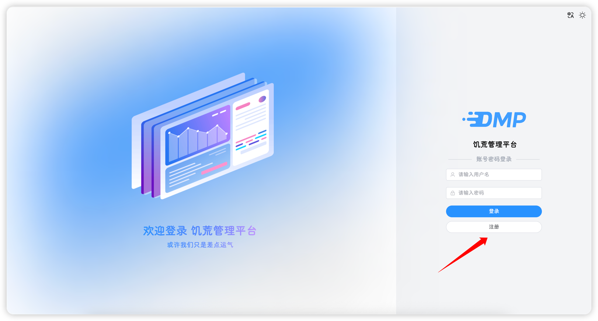
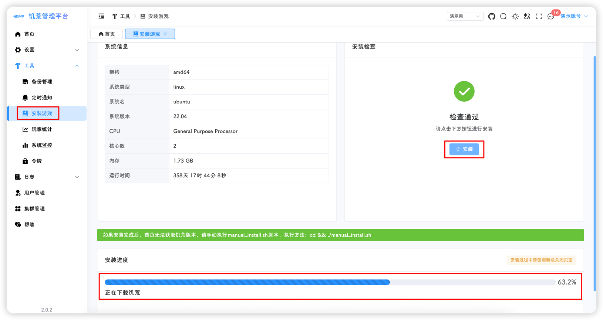
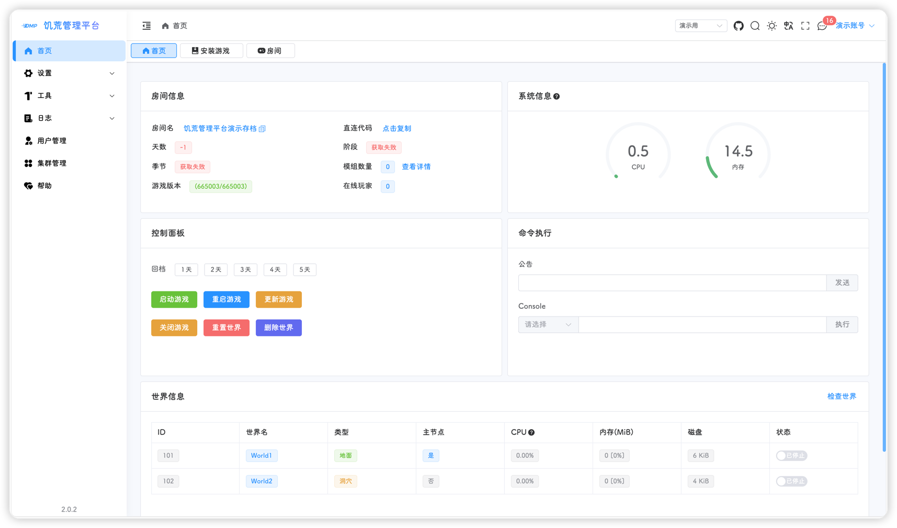
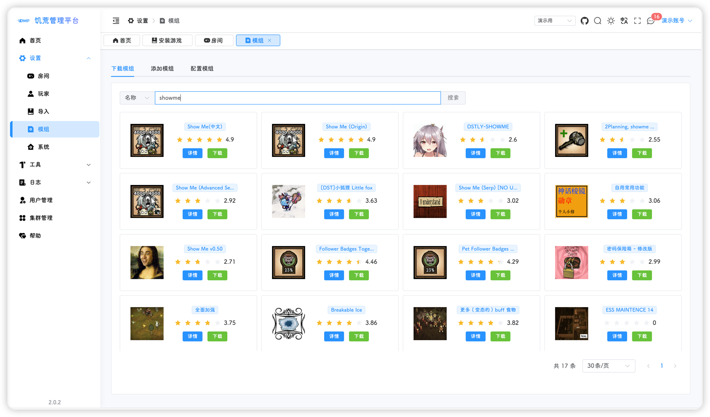
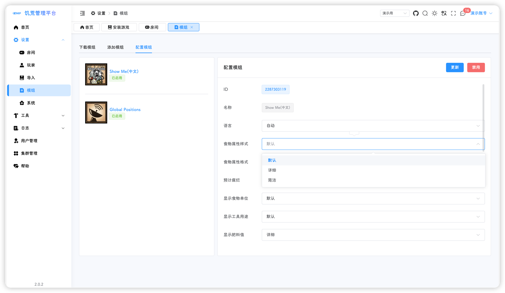

## 登录饥荒管理平台
#### 获取公网ip
1. 首先，我们回到腾讯云的控制面板，点击下方图片中的IPv4右边的复制按钮

2. 将复制好的IP粘贴进浏览器的地址栏并进入
::: tip
   如果能顺利打开，则跳过2.1和2.2步骤，如果不能顺利打开，则需要去腾讯云的控制面板，开放80端口
:::

2.1 点击下图中的防火墙标签页，并点击添加规则按钮

2.2 按照下图配置规则并点击确定

#### 用户注册
1. 如果你顺利打开了饥荒管理平台的页面，恭喜你，已经成功了一半，接下来我们将进行用户的注册

2. 填写好用户名，用户昵称还有密码，点击提交即可完成注册
::: tip
   一个平台只能注册一次，请快速完成注册操作，防止坏人捣乱
:::

3. 使用注册好的用户名密码进行登录

## 创建集群
1. 当我们登录成功并进入首页后，会有一个简短的引导，并提示新建集群；点击下图中的下拉菜单并选择新建集群

2. 在弹出的窗口中输入对应的信息，点击提交

3. 创建完成后，首页会自动跳转至该集群，你将看到下图的页面

## 安装游戏
1. 点击 工具 - 安装游戏，左边会显示系统的基本信息，点击右侧的 安装 按钮进行游戏安装
::: tip
饥荒游戏大概有4个多GB，安装时间取决于你的云服务器的下载速度和当时的网络环境，要耐心等待，并且不要重复安装和刷新页面（玩会儿手机吧
:::

::: tip
如果出现了安装失败或者一瞬间进度条就到100%，那么说明游戏安装有异常，大概率是网络环境不好，众所周知，steam能不能打开全看天意。我们需要再次点击安装，耐心等待
:::

## 游戏设置
::: tip
必须要等待游戏安装完毕后，才能进行游戏设置
:::

1. 点击 设置 - 房间，输入房间名，选择游戏模式、玩家数量、回档天数，输入 [令牌申请](./token.md) 中申请的令牌，点击下一步

2. 在世界设置中，点击一键带入 - 无尽-地面，自动加载地面的配置

3. 点击下图中的 + 按钮，新增一个世界后，继续点击一键带入 - 无尽-洞穴

4. 可以点击 可视化配置，进行世界设置调整，例如将地面的野火关闭；修改完成后，点击下一步

5. 模组设置可以先不管，直接点击下一步，即可完成配置，在最后一步点击 操作 - 保存

6. 保存完成后，首页就会显示对应的存档信息

7. 点击 设置 - 模组，进入模组配置，在下载模组标签页搜索自己想要添加的模组，并点击下载，我这边下载了showme和全球定位
::: tip
可同时下载多个模组，但不要重复下载
:::

8. 下载好的模组会出现在添加模组标签页中的表格中，点击右侧 操作 - 启用，即可添加对应的模组，分别启用showme和全球定位

9. 添加的模组会出现在配置模组标签页中，点击对应的模组，即可进行配置

10. 启动游戏  

模组配置完成后，所有的设置都已经完成了，可以查看一下自动生成的模组配置文件：点击 设置 - 房间，这次就不用点击保存了

也再来看一下首页

点击首页的 启动游戏 按钮，等待专用服务器启动完成，就可以进入游戏愉快的玩耍了

::: tip
首页的天数、阶段、季节获取失败的原因是无法读取游戏的核心文件，等待游戏自动保存后，就可以正常显示了
:::

查房结果，可以看到房间名、描述、模组、最大玩家数量都与之前设置的一致

